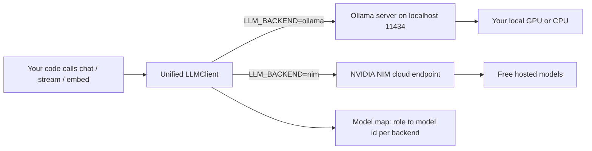
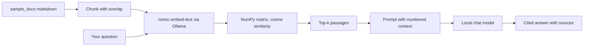

# ollama-local-llm-kit

**Run LLMs locally with Ollama, then switch to free cloud NVIDIA NIM with one flag — same code path.** Model manager, fully-local RAG, a streaming REPL, and a tokens/sec benchmark, tuned for consumer GPUs.

[](LICENSE)
[](https://www.python.org/)
[](https://ollama.com/)
[](https://build.nvidia.com/)
[](https://platform.openai.com/docs/api-reference)

## Why

Local models are the right default for prototyping: no key, no bill, no data leaving your machine. But some tasks need a bigger model than your GPU can hold. The usual answer is to rewrite your code against a cloud SDK — different client, different auth, different call shape.

This kit removes that rewrite. Both Ollama and NVIDIA NIM speak the OpenAI wire protocol, so a single `LLMClient` targets either one. You build and iterate fully local for zero dollars, and when you need a 70B-class model you flip `LLM_BACKEND=ollama` to `nim` — no code change. Same `chat`, `stream`, and `embed` calls; only the base URL, key, and model id move underneath.

## The one-flag switch

```python
from src.client import LLMClient

client = LLMClient.create()                       # reads LLM_BACKEND from the env
reply = client.chat([{"role": "user", "content": "Explain a B-tree in two sentences."}])
print(reply)
```

```bash
python your_script.py                 # runs on local llama3.1:8b via Ollama
LLM_BACKEND=nim python your_script.py # runs on cloud meta/llama-3.3-70b-instruct — same code
```

That is the whole thesis: **prototype local for free, scale to NIM without touching your code.**

## Architecture



A logical **role** — `chat`, `chat_small`, `vision`, `embed` — resolves to a concrete model id per backend through a small map. Your code asks for a role; the client picks the right model for wherever it is pointed.

The local RAG pipeline stays entirely on your machine:



## Local vs cloud: when to use which

| Dimension | Local Ollama | Cloud NVIDIA NIM |
|-----------|--------------|------------------|
| **Cost** | Free after download; runs on your hardware | Free tier, no credit card; rate-limited |
| **Privacy** | Data never leaves your machine | Prompts sent to NVIDIA's endpoint |
| **Latency** | No network hop; fast once loaded | Network round-trip; no local load time |
| **Quality ceiling** | Bounded by your VRAM — up to ~14B on 12 GB | 70B-class and larger, no local limit |
| **Offline** | Works with no internet | Needs a connection |
| **Best for** | Iteration, private data, high call volume | Hard tasks, big models, machines with a weak GPU |

Rule of thumb: **build and test local, reach for NIM when the task outgrows your GPU.** Same code either way.

## Quickstart

```bash
# 1. Install Ollama (see docs/install-ollama.md for Windows / WSL2 / macOS / Linux)
#    https://ollama.com/download

# 2. Pull a chat model and the embedding model for RAG
ollama pull llama3.1:8b
ollama pull nomic-embed-text

# 3. Clone and install this kit
git clone https://github.com/AleBrito124356/ollama-local-llm-kit.git
cd ollama-local-llm-kit
python -m venv .venv && . .venv/Scripts/activate   # Windows
#   source .venv/bin/activate                        # macOS / Linux
pip install -r requirements.txt

# 4. Configure (optional — defaults are fully local, no key needed)
cp .env.example .env

# 5. Chat, fully local
python -m src.chat
```

Going cloud is two steps: get a free key at **[build.nvidia.com](https://build.nvidia.com)** (it starts with `nvapi-`), put it in `.env` as `NVIDIA_API_KEY`, then run anything with `LLM_BACKEND=nim`.

## Usage

### Manage models

```bash
python -m src.model_manager recommend        # curated catalog with VRAM guidance
python -m src.model_manager list             # what you have installed
python -m src.model_manager pull qwen2.5:7b  # download with a live progress bar
python -m src.model_manager du               # disk usage by model
python -m src.model_manager remove llava:7b
```

```text
$ python -m src.model_manager du
        Disk usage by model
┏━━━━━━━━━━━━━━━━━━━┳━━━━━━━━━┓
┃ Model             ┃    Size ┃
┡━━━━━━━━━━━━━━━━━━━╇━━━━━━━━━┩
│ qwen2.5:7b        │  4.7 GB │
│ llama3.1:8b       │  4.7 GB │
│ nomic-embed-text  │  0.3 GB │
├───────────────────┼─────────┤
│ Total             │  9.7 GB │
└───────────────────┴─────────┘
```

### Streaming chat REPL

```bash
python -m src.chat            # local
python -m src.chat --rag      # start with local retrieval enabled
```

Switch everything live, mid-conversation:

```text
you /backend nim          # jump to cloud NVIDIA NIM
you /model qwen2.5:14b    # change model on the current backend
you /rag on               # ground answers in sample_docs/ with citations
you /models               # list installed local models
you /exit
```

### Fully-local, cited RAG

```bash
python -m src.rag_local build
python -m src.rag_local ask "How do I offload layers to the GPU?"
```

```text
To move more of the model onto the GPU, raise the num_gpu option, which sets how
many layers are offloaded [2]. If it exceeds your VRAM, loading falls back to the
CPU, so increase it gradually [2]. Setting num_gpu to 0 runs entirely on CPU [2].

Sources:
  [1] ollama_basics.md   (chunk 1, score 0.612)
  [2] gpu_offloading.md  (chunk 0, score 0.741)
```

### Benchmark tokens/sec

```bash
python -m src.benchmark                       # every installed local model
python -m src.benchmark --nim                 # add cloud NIM to the comparison
```

```text
                     tokens/sec benchmark
┏━━━━━━━━━┳━━━━━━━━━━━━━┳━━━━━━━━━━━━━┳━━━━━━━━┳━━━━━━━━━━┳━━━━━━━━━━━━┳━━━━━━┓
┃ Backend ┃ Model       ┃ First token ┃ Tokens ┃ Gen time ┃ Tokens/sec ┃ Load ┃
┡━━━━━━━━━╇━━━━━━━━━━━━━╇━━━━━━━━━━━━━╇━━━━━━━━╇━━━━━━━━━━╇━━━━━━━━━━━━╇━━━━━━┩
│ ollama  │ llama3.2:3b │      0.09 s │    200 │   2.11 s │       94.8 │ 0.4s │
│ ollama  │ llama3.1:8b │      0.14 s │    200 │   3.802s │       52.6 │ 0.6s │
└─────────┴─────────────┴─────────────┴────────┴──────────┴────────────┴──────┘
```

Local figures come straight from Ollama's own `eval_count` and `eval_duration`, so tokens/sec reflects what your GPU actually did. See [docs/gpu-notes.md](docs/gpu-notes.md) for the RTX 5070 / 12 GB sizing tables.

### Examples

```bash
python examples/function_calling.py     # tool calling on a local model
python examples/structured_output.py    # free text to validated Pydantic JSON
python examples/vision.py               # ask llava about an image
```

Every example uses the same unified client, so prefixing any of them with `LLM_BACKEND=nim` runs it on the cloud instead.

## Project structure

```text
ollama-local-llm-kit/
├── src/
│   ├── client.py          # unified OpenAI-compatible client + role-to-model map
│   ├── model_manager.py   # list / pull / show / remove / disk usage via Ollama API
│   ├── rag_local.py       # fully local RAG: nomic-embed-text + NumPy cosine + cited answers
│   ├── benchmark.py       # tokens/sec and first-token latency, local and NIM
│   └── chat.py            # streaming REPL with live /backend, /model, /rag switching
├── examples/
│   ├── function_calling.py
│   ├── structured_output.py
│   └── vision.py
├── sample_docs/           # bundled corpus for the RAG demo
├── docs/
│   ├── install-ollama.md  # Windows / WSL2 / macOS / Linux
│   └── gpu-notes.md       # num_gpu, context vs VRAM, Q4/Q5/Q8 quantization
├── models.yaml            # curated model catalog with VRAM guidance
├── requirements.txt
└── .env.example
```

## Configuration

Everything is driven by environment variables (see `.env.example`):

| Variable | Default | Purpose |
|----------|---------|---------|
| `LLM_BACKEND` | `ollama` | `ollama` (local) or `nim` (cloud) — the one-flag switch |
| `NVIDIA_API_KEY` | — | Free NIM key from build.nvidia.com, only for `nim` |
| `NIM_MODEL` | `meta/llama-3.3-70b-instruct` | Cloud chat model |
| `OLLAMA_HOST` | `http://localhost:11434` | Where the local server listens |
| `OLLAMA_CHAT_MODEL` | `llama3.1:8b` | Local chat model |
| `OLLAMA_EMBED_MODEL` | `nomic-embed-text` | Local embedding model for RAG |
| `OLLAMA_VISION_MODEL` | `llava:7b` | Local vision model |

## Related projects

Part of a family of small, focused AI engineering repos:

- **[llm-gateway](https://github.com/AleBrito124356/llm-gateway)** — An OpenAI-compatible gateway with caching, routing and cross-provider fallback in front of NIM, Ollama or any upstream. The natural next layer above this kit.
- **[rag-blueprints](https://github.com/AleBrito124356/rag-blueprints)** — Eight RAG architectures from naive to agentic, when the local RAG demo here whets your appetite.
- **[nim-agent-lab](https://github.com/AleBrito124356/nim-agent-lab)** — Twelve AI agent patterns in pure Python on free NVIDIA NIM.
- **[embeddings-playground](https://github.com/AleBrito124356/embeddings-playground)** — Compare and stress-test embeddings across NVIDIA NIM, Ollama and local models.

## License

MIT © 2026 Alejandro Brito. See [LICENSE](LICENSE).
