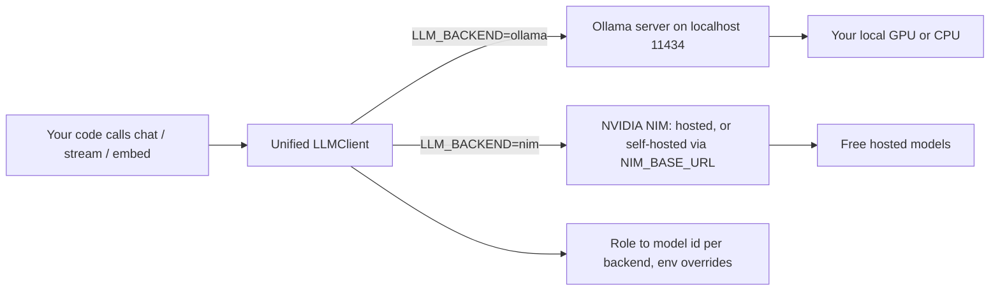
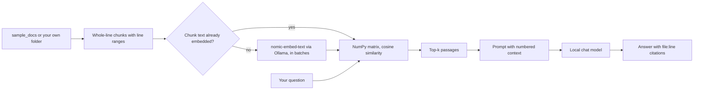

# ollama-local-llm-kit

**Run LLMs locally with Ollama, then switch to free cloud NVIDIA NIM with one flag — same code path.** A model manager that plans models against your GPU, cited RAG over your own documents, a streaming REPL, and a prefill/decode tokens/sec benchmark. Everything, including the test suite, also runs offline against a bundled fake server, with no Ollama, GPU or API key.

[](LICENSE)
[](https://www.python.org/)
[](https://ollama.com/)
[](https://build.nvidia.com/)
[](https://platform.openai.com/docs/api-reference)

## Why

Local models are the right default for prototyping: no key, no bill, no data leaving your machine. But some tasks need a bigger model than your GPU can hold. The usual answer is to rewrite your code against a cloud SDK, with a different client, different auth and a different call shape.

This kit removes that rewrite. Both Ollama and NVIDIA NIM speak the OpenAI wire protocol, so a single `LLMClient` targets either one. You build and iterate fully local for zero dollars, and when you need a 70B-class model you flip `LLM_BACKEND=ollama` to `nim` with no code change. The same `chat`, `stream` and `embed` calls work on both; the client handles the differences underneath: base URL, key, the concrete model id, and how an embedding says whether its text is a *query* or a *passage* (NIM's retrieval models require an `input_type` field; `nomic-embed-text` expects a task prefix instead).

## The one-flag switch

```python
from src.client import LLMClient

client = LLMClient.create()                       # reads LLM_BACKEND from the env
reply = client.chat([{"role": "user", "content": "Explain a B-tree in two sentences."}])
print(reply)

vectors = client.embed(["How do I offload layers?"], input_type="query")   # works on both backends
```

```bash
python your_script.py                 # runs on local llama3.1:8b via Ollama
LLM_BACKEND=nim python your_script.py # runs on cloud meta/llama-3.3-70b-instruct — same code
```

That is the whole thesis: **prototype local for free, scale to NIM without touching your code.**

## Architecture



A logical **role** (`chat`, `chat_small`, `vision`, `embed`) resolves to a concrete model id per backend. Your code asks for a role; the client picks the right model for wherever it is pointed. `chat_small` is a small model on both backends (`llama3.2:3b` locally, `meta/llama-3.1-8b-instruct` on NIM).

The RAG pipeline stays entirely on your machine:



## Local vs cloud: when to use which

| Dimension | Local Ollama | Cloud NVIDIA NIM |
|-----------|--------------|------------------|
| **Cost** | Free after download; runs on your hardware | Free tier, no credit card; rate-limited |
| **Privacy** | Data never leaves your machine | Prompts sent to NVIDIA's endpoint |
| **Latency** | No network hop; fast once loaded | Network round-trip; no local load time |
| **Quality ceiling** | Bounded by your VRAM — `fit` tells you exactly where | 70B-class and larger, no local limit |
| **Offline** | Works with no internet | Needs a connection |
| **Best for** | Iteration, private data, high call volume | Hard tasks, big models, machines with a weak GPU |

Rule of thumb: **build and test local, reach for NIM when the task outgrows your GPU.** Same code either way.

## Quickstart

```bash
# 1. Install Ollama (see docs/install-ollama.md for Windows / WSL2 / macOS / Linux)
#    https://ollama.com/download

# 2. Pull a chat model and the embedding model for RAG
ollama pull llama3.1:8b
ollama pull nomic-embed-text

# 3. Clone and install this kit
git clone https://github.com/AleBrito124356/ollama-local-llm-kit.git
cd ollama-local-llm-kit
python -m venv .venv && . .venv/Scripts/activate   # Windows
#   source .venv/bin/activate                        # macOS / Linux
pip install -r requirements.txt                      # or: pip install -e ".[dev]"

# 4. Configure (optional — defaults are fully local, no key needed)
cp .env.example .env

# 5. Check the setup, then chat fully local
python -m src.model_manager doctor
python -m src.chat
```

Going cloud is two steps: get a free key at **[build.nvidia.com](https://build.nvidia.com)** (it starts with `nvapi-`), uncomment `NVIDIA_API_KEY` in `.env` and paste it, then run anything with `LLM_BACKEND=nim`. If you forget to replace the placeholder, the kit says so and shows the sign-up steps instead of failing later with a 401.

## Try it without Ollama or a GPU

`src/fake_ollama.py` is a small offline server that speaks Ollama's native API and the OpenAI-compatible API (streaming, usage, tool calls, JSON mode, embeddings). Point the kit at it and every tool runs through its normal code path: `requests` for the native API, the official OpenAI SDK for `/v1`.

```bash
python -m src.fake_ollama --port 11555 --realtime          # terminal 1
```

```bash
# terminal 2 (PowerShell: $env:OLLAMA_HOST="http://127.0.0.1:11555")
export OLLAMA_HOST=http://127.0.0.1:11555
python -m src.model_manager list
python -m src.model_manager doctor
python -m src.benchmark --runs 2 --num-predict 48
python -m src.rag_local ask "How do I offload layers to the GPU?"
python examples/function_calling.py
python examples/structured_output.py
python -m src.chat
```

The NIM path works the same way against a strict NIM-like fake (it requires a `Bearer nvapi-...` key and `input_type` on embeddings, like the real service):

```bash
python -m src.fake_ollama --port 11556 --nim
LLM_BACKEND=nim NIM_BASE_URL=http://127.0.0.1:11556/v1 NVIDIA_API_KEY=nvapi-fake-key-for-local-tests python -m src.chat
```

The fake is not a language model. It echoes, answers RAG prompts by quoting the best-matching retrieved sentence, calls tools and fills JSON with simple heuristics, and embeds with feature-hashed bags of words (so retrieval over it is lexically meaningful). All of its speeds, load times and VRAM shares are canned values. `--realtime` makes replies really take those canned times, so first-token latency and end-to-end rates agree with them. Every sample output below was produced on a machine without a GPU, against this fake server wherever Ollama is involved, so the numbers illustrate the format, not real hardware.

## Usage

### Check your setup

```bash
python -m src.model_manager doctor            # exits 1 if something must be fixed
python -m src.model_manager doctor --online   # also calls the NIM endpoint's /models with your key
```

It checks Python, `LLM_BACKEND`, the Ollama server and version, whether the chat, embedding and vision models are installed (with the exact `pull` command if not), how much of every loaded model sits in VRAM (from Ollama's `/api/ps`), the NIM key (masked, format-checked offline), the GPU and RAM, and whether the default chat model fits. Against the fake server:

```text
┌────────┬─────────────────┬──────────────────────────────────────────────────────────────────────────────────────────┐
│ Status │ Check           │ Detail                                                                                   │
├────────┼─────────────────┼──────────────────────────────────────────────────────────────────────────────────────────┤
│ ok     │ Ollama server   │ v0.12.3-fake at http://127.0.0.1:11555                                                   │
│ ok     │ Chat model      │ llama3.1:8b installed                                                                    │
│ ok     │ Embedding model │ nomic-embed-text installed                                                               │
│ ok     │ Loaded now      │ llama3.1:8b: 100% on GPU                                                                 │
│ warn   │ Loaded now      │ qwen2.5:14b: 72% GPU / 28% CPU, partially offloaded; tokens/sec will drop. Lower num_ctx │
│        │                 │ or pick a smaller model (python -m src.model_manager fit)                                │
│ info   │ NVIDIA_API_KEY  │ NVIDIA_API_KEY is not set. Only needed for LLM_BACKEND=nim; free key at                  │
│        │                 │ https://build.nvidia.com                                                                 │
│ warn   │ GPU             │ no NVIDIA GPU detected (nvidia-smi not found: no NVIDIA driver, or a non-NVIDIA GPU).    │
│        │                 │ Models run on the CPU unless Ollama finds another GPU; plan with: python -m              │
│        │                 │ src.model_manager fit --vram <GB>                                                        │
└────────┴─────────────────┴──────────────────────────────────────────────────────────────────────────────────────────┘
```

(Rows trimmed. The GPU shares in "Loaded now" are the fake's canned values.)

### Plan models against your GPU

```bash
python -m src.model_manager fit --ctx 8192                          # the catalog, on the detected GPU
python -m src.model_manager fit qwen2.5:14b llama3.1:8b --vram 12 --ctx 32768
python -m src.model_manager fit --installed --vram 8                # any installed model, from its GGUF metadata
python -m src.model_manager fit --ctx 32768 --kv-cache q8_0         # with OLLAMA_KV_CACHE_TYPE=q8_0
python -m src.model_manager recommend                               # catalog marked for this machine
```

`fit` estimates weights + KV cache (`2 x layers x kv_heads x head_dim x bytes x num_ctx`) + a fixed 1 GiB overhead. It says whether the model fits in VRAM, how many layers Ollama could keep on the GPU if not, and the largest `num_ctx` that stays fully on the GPU. The GPU is detected with `nvidia-smi` and RAM from the OS. Other GPUs are not detected; pass `--vram`.

```text
Planning for 12.0 GiB VRAM (--vram)  |  15.7 GiB RAM (detected)
num_ctx 32768, KV cache f16, overhead 1.0 GiB
                                          Will it fit? (num_ctx = 32768)
┌─────────────┬─────────┬──────────┬──────────┬───────────────────────────────┬────────────┬──────────────────────┐
│ Model       │ Weights │ KV cache │    Total │ Verdict                       │ GPU layers │ Max ctx fully on GPU │
├─────────────┼─────────┼──────────┼──────────┼───────────────────────────────┼────────────┼──────────────────────┤
│ qwen2.5:14b │ 8.4 GiB │  6.0 GiB │ 15.4 GiB │ partial offload (~75% on GPU) │      36/48 │               13,312 │
│ llama3.1:8b │ 4.6 GiB │  4.0 GiB │  9.6 GiB │ fits in VRAM                  │      32/32 │               52,224 │
└─────────────┴─────────┴──────────┴──────────┴───────────────────────────────┴────────────┴──────────────────────┘
```

These are estimates; `doctor` and the benchmark show the real split once a model is loaded. See [docs/gpu-notes.md](docs/gpu-notes.md) for the formula and a 12 GB sizing table.

### Manage models

```bash
python -m src.model_manager list             # what you have installed
python -m src.model_manager pull qwen2.5:7b  # download with a live progress bar (all layers aggregated)
python -m src.model_manager show qwen2.5:7b  # family, quantization, capabilities, default parameters
python -m src.model_manager du               # disk usage; tags that share blobs are counted once
python -m src.model_manager remove llava:7b
```

```text
$ python -m src.model_manager du
                  Disk usage by model
┌─────────────────────────┬──────────┬─────────────────┐
│ Model                   │     Size │ Shared with     │
├─────────────────────────┼──────────┼─────────────────┤
│ qwen2.5:14b             │   9.0 GB │                 │
│ llama3.1:8b             │   4.9 GB │ llama3.1:latest │
│ llava:7b                │   4.7 GB │                 │
│ llama3.2:3b             │   2.0 GB │                 │
│ bge-m3:latest           │   1.2 GB │                 │
│ nomic-embed-text:latest │ 274.3 MB │                 │
├─────────────────────────┼──────────┼─────────────────┤
│ Total on disk           │  22.1 GB │                 │
└─────────────────────────┴──────────┴─────────────────┘
1 tag(s) share the same manifest digest as another tag and are counted once.
```

Sizes use decimal units, like `ollama list`.

### Streaming chat REPL

```bash
python -m src.chat                        # local
python -m src.chat --rag                  # start with retrieval over sample_docs/
python -m src.chat --rag-docs ~/notes     # start with retrieval over your own folder
```

Switch everything live, mid-conversation:

```text
you /backend nim          # jump to cloud NVIDIA NIM
you /model qwen2.5:14b    # change model on the current backend
you /rag on ~/notes       # ground answers in a folder, with file:line sources
you /rag off
you /models               # list installed local models
you /exit
```

Model output is printed literally, so text such as `[INST]`, `[/INST]` or `[bold]` in a reply shows up as written instead of being parsed as terminal markup (which used to crash the REPL).

### Cited RAG over your own documents

```bash
python -m src.rag_local build                                  # sample_docs/
python -m src.rag_local build --docs ~/notes --glob "*.md,*.txt"
python -m src.rag_local ask "How do I offload layers to the GPU?"
python -m src.rag_local ask "What is our retry policy?" --docs ./docs --min-score 0.35
python -m src.rag_local ask "What is num_ctx?" --json          # {question, answer, found, sources[]} on stdout
python -m src.rag_local search "num_ctx" --k 3                 # retrieval only, no chat model
```

- **Any folder**: `--docs` is searched recursively (hidden folders, `.git`, `.venv`, `node_modules` and similar are skipped); `--glob` picks the files (default `*.md,*.txt,*.rst`).
- **Incremental**: each corpus has its own cache in `.rag_cache/` (or `RAG_CACHE_DIR`), keyed by a hash of every chunk's text. A rebuild embeds only new or changed chunks and prunes deleted ones. Switching the embedding model re-embeds everything. Embeddings go out in batches of `--batch` (default 32) behind a progress bar.
- **Exact citations**: chunks are whole lines, so every source is a line range you can open.
- **Honest misses**: with `--min-score`, if even the best passage scores below the threshold, the answer is "Not found in the documents." and the chat model is never called.

```text
$ python -m src.rag_local ask "How do I offload layers to the GPU?"
3 file(s), 9 chunks: embedded 0, reused 9, pruned 0  (nomic-embed-text via ollama)

You can override this with the `num_gpu` option, which sets the number of model layers to offload to the GPU [1].
Watch VRAM usage while a model loads: if the runtime reports offloading only part of the layers to the GPU, either
pick a smaller model or a heavier quantization to reclaim memory [2].

Sources:
  [1] gpu_offloading.md:L1-L17  score 0.432
  [2] gpu_offloading.md:L25-L41  score 0.289
  [3] gpu_offloading.md:L14-L27  score 0.184
  [4] ollama_basics.md:L31-L46  score 0.041
```

(Answer text and scores from the fake server; a real model writes its own answer and `nomic-embed-text` produces different scores.)

### Benchmark tokens/sec

```bash
python -m src.benchmark                                      # every installed chat model (embedding models skipped)
python -m src.benchmark --models llama3.1:8b qwen2.5:14b --runs 5
python -m src.benchmark --models qwen2.5:14b --num-ctx 16384 --num-gpu 40 --keep-alive 5m
python -m src.benchmark --nim                                # add cloud NIM to the same table
python -m src.benchmark --json results.json --csv results.csv --markdown results.md   # '-' = stdout
```

Each model gets one warm-up request (its load time is the "Cold load" column, excluded from the statistics) and then `--runs` measured requests. The table shows medians and the min-max decode range. Each run's prompt starts with a distinct `[run N]` tag so Ollama's prompt cache cannot skip prompt processing.

- **Prefill tok/s**: prompt processing, from Ollama's `prompt_eval_count / prompt_eval_duration`.
- **Decode tok/s**: generation speed, from Ollama's `eval_count / eval_duration`. For NIM it is measured on the client between the first and last streamed chunk, so it excludes time-to-first-token and the two backends can be compared.
- **End-to-end tok/s**: tokens over the whole request's wall time, first-token latency included.
- **On GPU**: the share of the model Ollama kept in VRAM (`/api/ps`). Below 100%, layers were offloaded to the CPU; the benchmark says so and points at `fit`.

Errors are reported as errors, not as 0 tok/s: an out-of-memory event in Ollama's stream, an HTTP error body or a malformed line becomes an error row with Ollama's message.

```text
GPU: none detected (nvidia-smi not found: no NVIDIA driver, or a non-NVIDIA GPU)  |  RAM: 15.7 GiB, 2.4 GiB free
                                            tokens/sec benchmark (medians)
┌─────────┬─────────────┬──────┬─────────────┬────────────┬─────────────┬───────────┬────────────┬───────────┬────────┐
│         │             │      │             │    Prefill │      Decode │           │ End-to-end │           │        │
│ Backend │ Model       │ Runs │ First token │      tok/s │       tok/s │   min-max │      tok/s │ Cold load │ On GPU │
├─────────┼─────────────┼──────┼─────────────┼────────────┼─────────────┼───────────┼────────────┼───────────┼────────┤
│ ollama  │ llama3.2:3b │    3 │      0.02 s │     2400.0 │        95.0 │ 95.0-95.0 │       88.8 │    1.20 s │   100% │
│ ollama  │ llama3.1:8b │    3 │      0.03 s │     1180.0 │        52.5 │ 52.5-52.5 │       50.6 │    2.10 s │   100% │
│ ollama  │ qwen2.5:14b │    3 │      0.08 s │      310.0 │        14.2 │ 14.2-14.2 │       14.1 │    5.80 s │    72% │
└─────────┴─────────────┴──────┴─────────────┴────────────┴─────────────┴───────────┴────────────┴───────────┴────────┘
qwen2.5:14b: only 72% of the model is in VRAM; the rest runs on the CPU and caps decode speed. Lower --num-ctx or try a
smaller model; plan it with python -m src.model_manager fit
```

(Canned speeds from `python -m src.fake_ollama --realtime`; run it against your own Ollama for real numbers.)

### Examples

```bash
python examples/function_calling.py     # tool calling with a safe calculator and a canned weather tool
python examples/structured_output.py    # free text to validated Pydantic JSON
python examples/vision.py               # ask llava about an image (draws a sample with Pillow if you pass none)
```

Every example uses the same unified client, so prefixing any of them with `LLM_BACKEND=nim` runs it on the cloud instead. The calculator tool parses the model's expression into an AST and only evaluates numbers and `+ - * / // % **`, with size limits, so an expression such as `9**9**9**9` comes back as a JSON error immediately instead of hanging the process:

```text
[backend=ollama  model=llama3.1:8b]

-> calculate({"expression": "128 * 47"}) = {"expression": "128 * 47", "result": 6016}
-> get_weather({"city": "Panama City"}) = {"city": "Panama City", "temp_c": 30, "condition": "thunderstorms", "humidity": 0.84}
```

### Self-hosted NIM

The `nim` backend defaults to NVIDIA's hosted API. To use a NIM container on your own machine or cluster, point it there; a self-hosted container does not need an NVIDIA key:

```bash
NIM_BASE_URL=http://localhost:8000/v1 LLM_BACKEND=nim python -m src.chat
```

## Configuration

Everything is driven by environment variables (see `.env.example`). The kit reads a `.env` file from the current directory, or else from the repo root, and never from parent folders. `PYTHON_DOTENV_DISABLED=1` turns `.env` loading off.

| Variable | Default | Purpose |
|----------|---------|---------|
| `LLM_BACKEND` | `ollama` | `ollama` (local) or `nim` (cloud) — the one-flag switch |
| `NVIDIA_API_KEY` | — | Free NIM key from build.nvidia.com, only for hosted `nim` |
| `NIM_BASE_URL` | `https://integrate.api.nvidia.com/v1` | Point `nim` at a self-hosted NIM container |
| `NIM_MODEL` | `meta/llama-3.3-70b-instruct` | Cloud chat model |
| `NIM_CHAT_SMALL_MODEL` | `meta/llama-3.1-8b-instruct` | Cloud `chat_small` model |
| `NIM_VISION_MODEL` | `meta/llama-3.2-90b-vision-instruct` | Cloud vision model |
| `NIM_EMBED_MODEL` | `nvidia/nv-embedqa-e5-v5` | Cloud embedding model |
| `OLLAMA_HOST` | `http://localhost:11434` | Where the local server listens (`host:port` and `0.0.0.0:port` accepted) |
| `OLLAMA_CHAT_MODEL` | `llama3.1:8b` | Local chat model |
| `OLLAMA_CHAT_SMALL_MODEL` | `llama3.2:3b` | Local `chat_small` model |
| `OLLAMA_EMBED_MODEL` | `nomic-embed-text` | Local embedding model for RAG |
| `OLLAMA_VISION_MODEL` | `llava:7b` | Local vision model |
| `RAG_CACHE_DIR` | `.rag_cache/` in the repo | Where RAG vector caches are stored |

Model variables are read when a request is made, so changing them (or editing `src.client.MODEL_MAP`) takes effect immediately in every module.

## Tests

```bash
pip install -e ".[dev]"      # or: pip install pytest pillow
python -m pytest -q
```

The suite needs no Ollama, GPU, key or internet. It starts the fake server on a random loopback port, clears every environment variable the kit reads, disables `.env` loading, and blocks every non-loopback connection and DNS lookup, also in the subprocesses it launches to run the CLIs and examples end to end. Every bug fixed in 0.2.0 has a regression test; see [CHANGELOG.md](CHANGELOG.md).

## Project structure

```text
ollama-local-llm-kit/
├── src/
│   ├── client.py          # unified OpenAI-compatible client, role-to-model map, key checks
│   ├── model_manager.py   # list / pull / show / remove / du / recommend / fit / doctor
│   ├── hardware.py        # nvidia-smi + RAM detection, VRAM and KV-cache fit planner
│   ├── rag_local.py       # local RAG: any folder, incremental cache, file:line citations
│   ├── benchmark.py       # warm-up + N runs, prefill/decode tok/s, GPU share, exports
│   ├── chat.py            # streaming REPL with live /backend, /model, /rag switching
│   └── fake_ollama.py     # offline fake Ollama / NIM server for demos and tests
├── examples/
│   ├── function_calling.py
│   ├── structured_output.py
│   └── vision.py
├── tests/                 # pytest suite, all offline
├── sample_docs/           # bundled corpus for the RAG demo
├── docs/
│   ├── install-ollama.md  # Windows / WSL2 / macOS / Linux
│   └── gpu-notes.md       # VRAM math, num_gpu / num_ctx, quantization, 12 GB sizing table
├── models.yaml            # curated catalog with sizes and transformer shapes for `fit`
├── pyproject.toml
├── requirements.txt
├── CHANGELOG.md
└── .env.example
```

## Related projects

Part of a family of small, focused AI engineering repos:

- **[llm-gateway](https://github.com/AleBrito124356/llm-gateway)** — An OpenAI-compatible gateway with caching, routing and cross-provider fallback in front of NIM, Ollama or any upstream. The natural next layer above this kit.
- **[rag-blueprints](https://github.com/AleBrito124356/rag-blueprints)** — Eight RAG architectures from naive to agentic, when the local RAG demo here whets your appetite.
- **[nim-agent-lab](https://github.com/AleBrito124356/nim-agent-lab)** — Twelve AI agent patterns in pure Python on free NVIDIA NIM.
- **[embeddings-playground](https://github.com/AleBrito124356/embeddings-playground)** — Compare and stress-test embeddings across NVIDIA NIM, Ollama and local models.

## License

MIT © 2026 Alejandro Brito. See [LICENSE](LICENSE).
